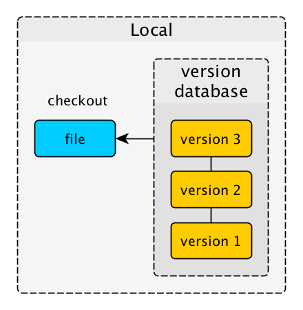
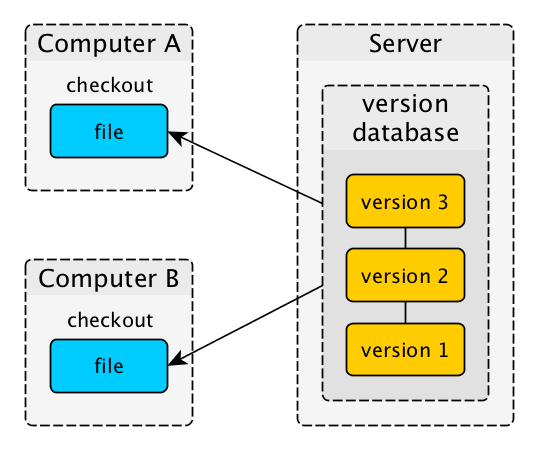

# Introduction

📌 Learning objectives:

- Learn some definitions about versioning
- Understand how versioning control systems work
- Install Git to get started

## Versioning

Software versioning is the process of assigning either unique version names or
unique version numbers to unique states of computer software.

**Undo** is the simplest form of versioning.

## Version Control System

A **VCS** records changes to a file or set of files over time so that you can
recall specific versions later. There are three different architectures.

### Local

### Centralized

Everything is tracked on the server with a shared repository (subversion-style).

### Decentralized

## Git

- Decentralized Version Control System (DVCS) for tracking changes
- Created by Linus Torvalds in 2005 for the development of the Linux kernel
- Free and open source, **blazing fast**

### Why Git?

- Fast (like really fast)
- Good at resolving conflicts (automatically)
- Very flexible and powerful
- _De facto_ standard for almost 8+ years

TODO: maybe add a more general answer here. This is too software dev oriented.

## Install party 🎉
