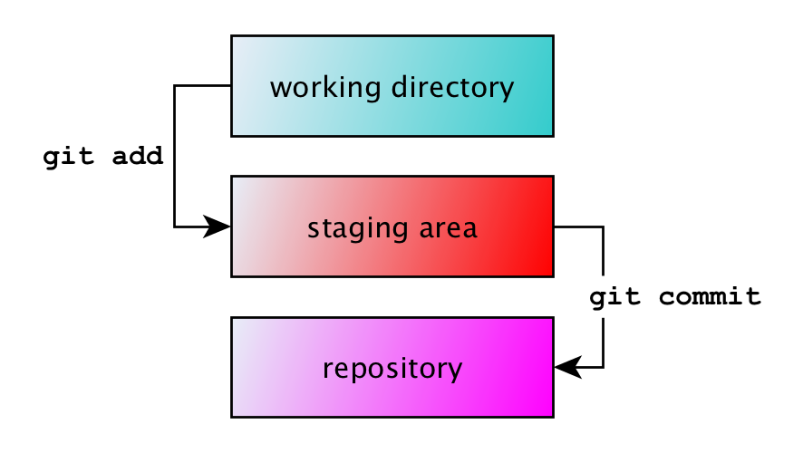
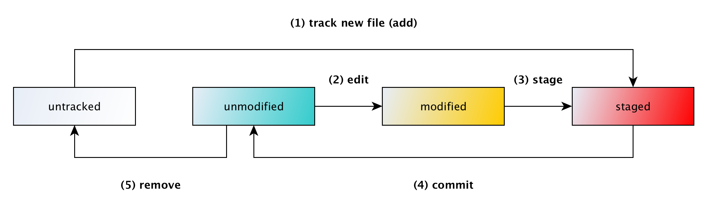
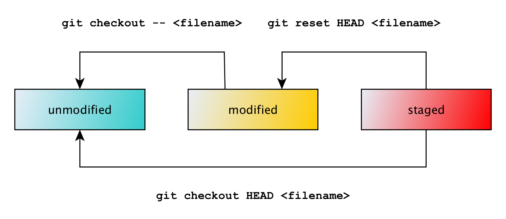

# Working alone

📌 Learning objectives:

- Learn to use Git alone


## Local first

With Git, **everything is local**, remote operations are only for sharing. You
do not have to be connected to Internet or any server to work.


## Git only tracks files

Git has no notion of directories, **only files are tracked** (technically,
contents).


## Git help

`git help` gives general guidelines on Git usage. It can also be applied on a
specific `command`:

``` bash
$ git help [command]
```


## Configuring your identity

``` bash
$ git config --global user.name "Your name here"
$ git config --global user.email "name@example.org"
```

Git stores global configuration settings in `~/.gitconfig`.


## Creating a repository

Move to your **working directory** and initialize a Git **repository**,
containing the whole project history:

``` bash
$ cd /path/to/project
$ git init

Initialized empty Git repository in /path/to/project/.git/
```

Running `git init` in an existing repository will not overwrite things that are
already there.


<!-- .slide: class="hands-on" -->
## 🚀 Hands-on

1. Configure your identity
2. Create a Git repository named "git-training"
3. Inspect its content with the Finder/File viewer/Explorer


## What's up?

`git status` gives you many information about your project, _i.e._ about the
working directory and Git repository:

``` bash
$ git status
On branch master

Initial commit

nothing to commit (create/copy files and use "git add" to track)
```


## Adding files

``` bash
$ touch mars.txt
$ git add mars.txt
$ git commit -m "Add mars.txt"
```

- `git add`: adds files to the **staging area**
- `git commit`: commits the state of the staging area


## Staging area

The **staging area** is a place where we can group files together before we
"commit" them to Git.





## Git add

`git add` adds files to the **staging area**.

- When files are new, it enables tracking on these files
- When files are tracked, only the changes are added


## Git commit

`git commit` makes the changes of the staging area part of the local Git
repository. A **commit message** is required.

<br>


### Writing good commit messages

``` plaintext
Capitalized, short (50 chars or less) summary

More detailed explanatory text, if necessary.  Wrap it to about 72
characters or so. In some contexts, the first line is treated as the
subject of an email and the rest of the text as the body. The blank
line separating the summary from the body is critical (unless you
omit the body entirely); tools like rebase can get confused if you
run the two together.

Write your commit message in the imperative: "Fix bug" and not "Fixed
bug" or "Fixes bug." This convention matches up with commit messages
generated by commands like git merge and git revert.

Further paragraphs come after blank lines.
```

[A Note About Git Commit
Messages](http://tbaggery.com/2008/04/19/a-note-about-git-commit-messages.html)


### On commit identifiers

Each commit is identified by a **hash** (SHA).

``` bash
$ git show f7ff9ec81552261105ce8573c14dd46d8a8c2aad
```

It is a long id but you can usually type the first chars only:

``` bash
$ git show f7ff9
```

---

`HEAD` is a special reference to the most recent commit.


## Git log

`git log` displays all the commits of your project. You can also pass a
`filename` to filter the commits.

```
$ git log
commit 2d95be7716feb718d0cd623eb0c778bbf7f512c4
Author: William Durand <will+git@drnd.me>
Date:   Sun Sep 17 21:17:04 2017 +0200

    Add mars.txt

commit 4b24c727e6754b0fcc3245cd53880a100f58981f
Author: William Durand <will+git@drnd.me>
Date:   Sun Sep 17 21:16:50 2017 +0200

    Add README.md
```


## Viewing a specific commit

`git show <commit>` displays the information of a given commit or the most
recent commit if none specified:

```
$ git show 4b24c727e6754b0fcc3245cd53880a100f58981f
commit 4b24c727e6754b0fcc3245cd53880a100f58981f
Author: William Durand <will+git@drnd.me>
Date:   Sun Sep 17 21:16:50 2017 +0200

    Add README.md

diff --git a/README.md b/README.md
new file mode 100644
index 0000000..e69de29
```


<!-- .slide: class="hands-on" -->
## 🚀 Hands-on

1. Create a file named `README.md`
2. Add it to the staging area
3. Verify that it worked
4. Commit this file with the `-m` option
5. Create a file named `mars.txt`
6. Commit it with `git commit` (no option)


## Moving files

``` bash
$ git mv some-file.txt better-name.txt
```

``` bash
$ git status
On branch master
Changes to be committed:
  (use "git reset HEAD <file>..." to unstage)

	renamed:    some-file.txt -> better-name.txt
```

``` bash
$ git commit -m "Rename some-file.txt to better-name.txt"
```


## Removing files

``` bash
$ git rm better-name.txt
rm 'better-name.txt'
```

``` bash
$ git status
On branch master
Changes to be committed:
  (use "git reset HEAD <file>..." to unstage)

	deleted:    better-name.txt
```

``` bash
$ git commit -m "Delete better-name.txt"
```


<!-- .slide: class="hands-on" -->
## 🚀 Hands-on

1. Create a file named `baz.txt`
2. Commit it
3. Rename this file to `venus.txt`
4. Commit it
5. View the log for this file


## Git checkout

`git checkout` allows to restore an old version of a file:

``` bash
$ git checkout <commit> <filename>
```

It is useful to discard changes in the working directory:

``` bash
$ git checkout -- <filename>
```


## Git reset

`git reset` can be used to **unstage** a file:

``` bash
$ git reset HEAD <filename>
```

``` bash
$ git reset -- <filename>
```


## The lifecycle of files




## Updating the status of a file




<!-- .slide: class="hands-on" -->
## 🚀 Hands-on

1. Create a new file `nope.txt`
2. Add it to the staging area
3. Undo the previous step and see what happens
4. Update the content of `venus.txt`
5. Add this change to the staging area
6. Undo the previous step and see what happens
7. Update the content of `venus.txt` and commit


## Git diff

`git diff <commit>` shows the difference between the last commit and unstaged
changes in the current project:

``` diff
$ git diff
diff --git a/venus.txt b/venus.txt
index 257cc56..3bd1f0e 100644
--- a/venus.txt
+++ b/venus.txt
@@ -1 +1,2 @@
 this is about venus
+bar
```


### Staged changes

To see the difference between staged changes and the previous version of the
repository, use:

``` bash
git diff --staged
```


<!-- .slide: class="hands-on" -->
## 🚀 Hands-on

1. Modify the content of your `README.md` file
2. Review your changes
3. Commit them


## Ignoring things

Git can be configured with a special `.gitignore` file to mask certain files.
You can use wildcards, regular expressions and exact filenames.


### Gitkeep

Sometimes, you want to exclude all files of a given directory but keep this
directory under version control.

Commit a `.gitkeep` file into it before ignoring it.


<!-- .slide: class="hands-on" -->
## 🚀 Hands-on

1. Create a `.gitignore` file and commit it
2. Ignore the directory named `result/`
3. Create this directory and add files into it
4. See what happens
5. Keep this `result/` directory under version control


## Git stash

`git stash` is a nice Git feature that allows you to put a set of changes on
hold and get back to them later.

- `git stash` takes the state of the staging area and saves it as a "draft"
- `git stash pop`: apply the latest "draft" and remove it from the list
- `git stash list`: list all your "drafts"


## Branching

Branches are what naturally happens when you want to work on multiple features
at the same time.

You wouldn't want to end up with a `master` branch that has Feature A half done
and Feature B half done.


### Creating a branch

`git branch` lists the local branches of your project:

``` bash
$ git branch
* master
```

`git checkout feature` switches to the branch named `feature` if it
exists. To create a branch and switch to it, you can also use:

``` bash
$ git checkout -b feature
Switched to a new branch 'feature'
```


<!-- .slide: class="hands-on" -->
## 🚀 Hands-on

1. Create a branch named `feature`
2. Switch to it (if not done in a single command)
3. Create and commit the following files: `pluton.txt`, `jupyter.txt` and
   `earth.txt`
4. Switch to the `master` branch and see what happens


### Merging a branch

Merging is Git's way of putting a forked history back together again. The `git
merge` command lets you take the independent lines of development created by
`git branch` and integrate them into a single branch.

``` bash
$ git merge feature
```

Always generate a merge commit:

``` bash
$ git merge --no-ff feature
```


### Deleting a branch

``` bash
$ git branch -d feature
```

Force delete a branch with `-D`:

``` bash
$ git branch -D branch-not-merged
```


<!-- .slide: class="hands-on" -->
## 🚀 Hands-on

1. Switch to `master` and merge `feature` into it
2. View the log with the `--graph` option
3. Create a branch named `feature-no-ff`
4. Add a new file `mercury.txt` and commit it
5. Switch to `master` and merge this branch with the `--no-ff` option
6. View the log with the `--graph` option
