# Collaborating with Git

📌 Learning objectives:

- Learn to collaborate with Git
- Discover GitLab/GitHub
- Start working in team


## Git alone

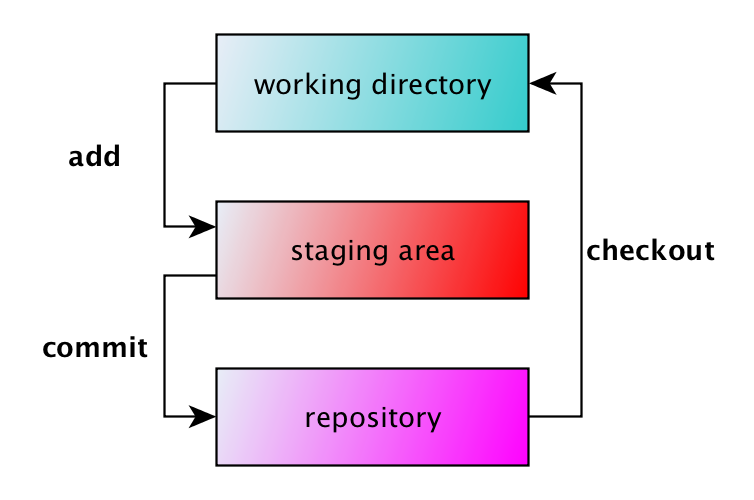


## The missing piece


## Git remotes

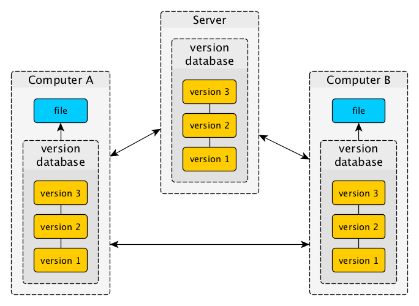


### Managing remotes

Remote repositories are versions of your project that are hosted on the Internet
or network somewhere.

<br>

``` bash
$ git remote -v
origin	git@github.com:tailordev-academy/git-101.git (fetch)
origin	git@github.com:tailordev-academy/git-101.git (push)
```

``` bash
$ git remote add <name> <repo>
```

``` bash
$ git remote rm <name>
```

``` bash
$ git remote set-url <name> <new repo>
```


## Git clone

`git clone <repo>` downloads a full copy of a repository into a new directory.
Different protocols are supported: file, HTTPS, SSH, etc.

It automatically setups a default `origin` remote for `repo` that you can use
for `push` and `pull`.


## Git pull

`git pull <remote> <branch>` copies changes from a remote repository to a local
repository.


### Pull = Fetch + Merge

`git pull` is a shortcut for `git fetch` + `git merge`.

`git fetch` retrieves the commits from a remote repository, but do not apply
them on your working directory. `git merge` applies them.


## Git push

`git push <remote> <branch>` copies changes from a local repository to a remote
repository.


## Introducing GitLab

GitLab is an Open Source (MIT licensed) web-based Git repository manager with
wiki and issue tracking features.

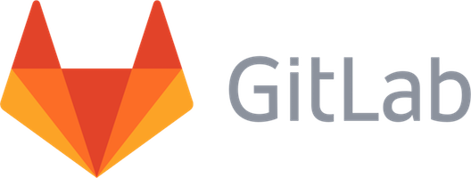


### Integrated issue tracking

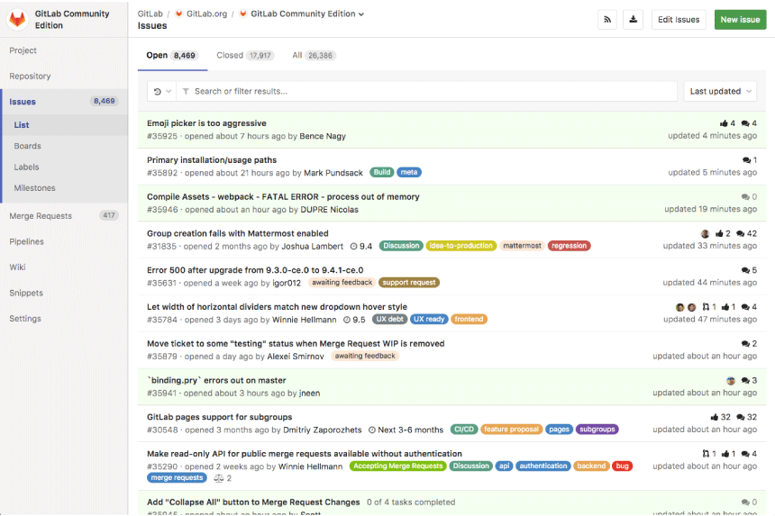


### Enriched markdown support

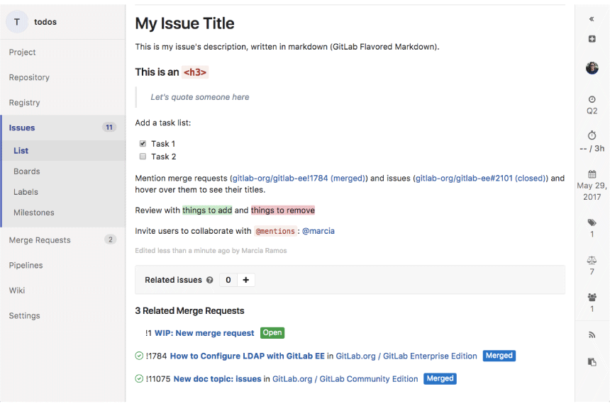


### Confidential issues

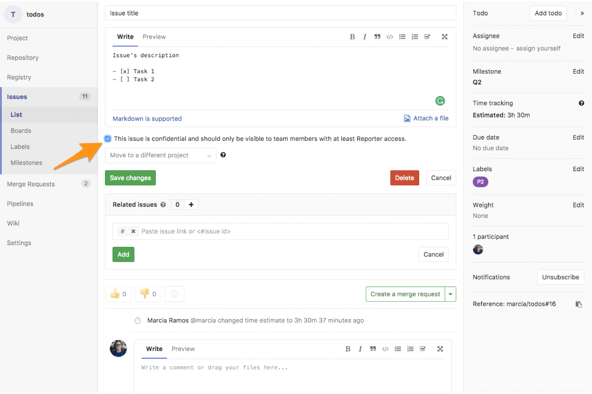


### Issue boards

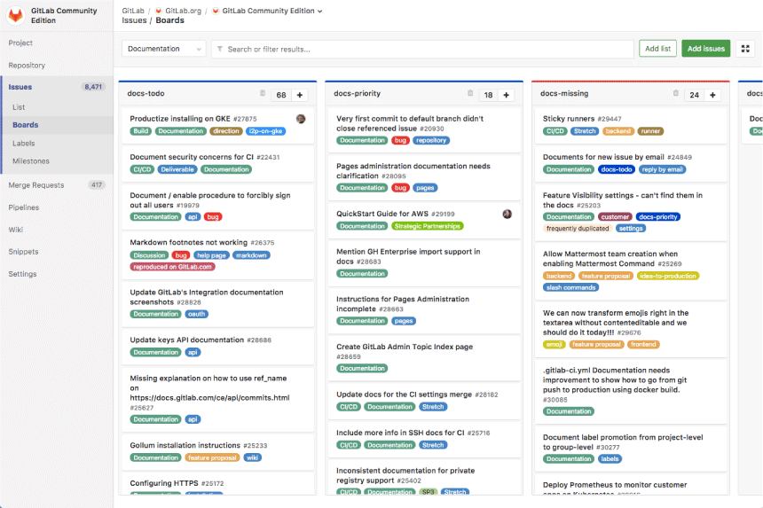


### Merge Requests

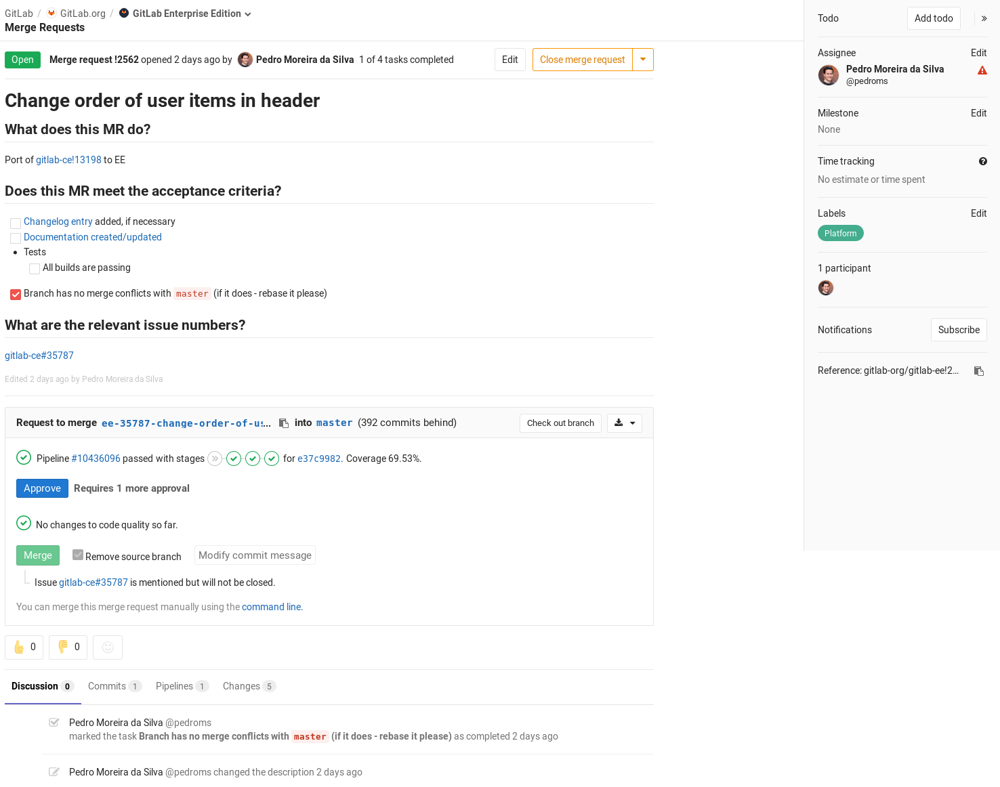


### Diff (side by side)

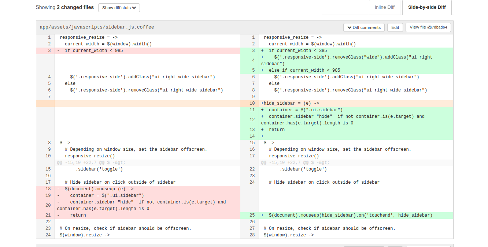


### Resolve conflicts

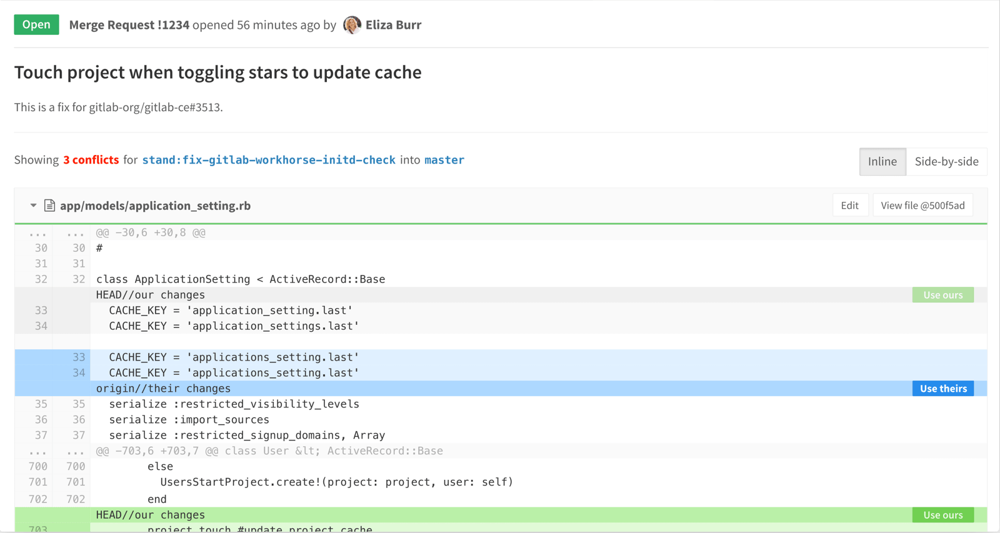


### Activity stream

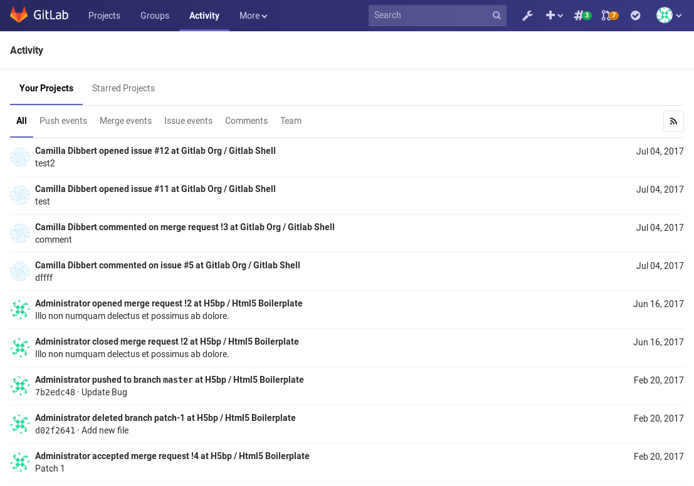


### Protected branches

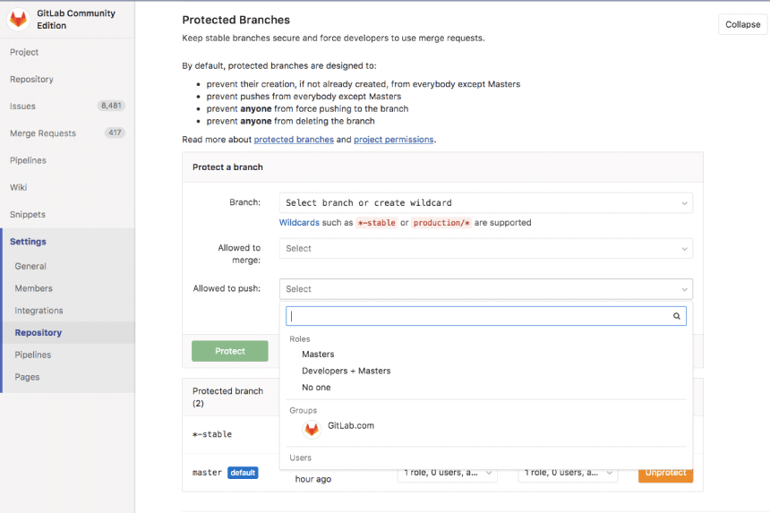


### CI/CD

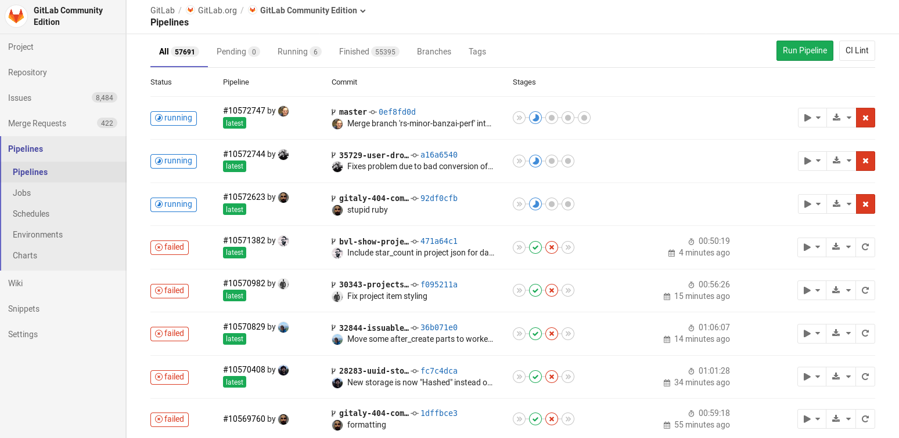


<!-- .slide: class="hands-on" -->
## 🚀 Hands-on

1. Log in to **https://gitlab.com/**
2. Create a group
3. Create a project inside this group
4. Add a `README.md` file _via_ GitLab
5. Clone this repository locally


<!-- .slide: class="hands-on" -->
## 🚀 Hands-on

1. Create a feature branch
2. Add a `CONTRIBUTING.md` file
3. Push this branch to GitLab
4. Open a merge request
5. Review your changes and merge
6. Synchronize your local repository


## Workflows

Git can support your project not just with version control, but also with
collaboration and release management.

There are many workflows but let's focus on a simple one.


### The simple Git branching model

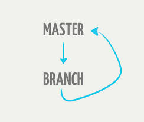

- `master` must always be deployable
- all changes made through **feature branches** (merge request + merge)
- rebase to avoid/resolve conflicts; merge in to `master`


#### DO ...

- keep `master` in working order
- rebase your feature branches
    - pull in (rebase on top of) changes
- tag releases
- push feature branches for discussion
- learn to rebase


#### DON'T ...

- merge in broken code
- commit onto `master` directly
    - no hotfix onto `master`, use a feature branch
- rebase `master`
- merge with conflicts, handle conflicts upon rebasing


## Git rebase

`git rebase` "replays" the commits of your branch on top of a branch, usually
`master`.

You may have to "force-push" your branch (`-f`) since commits are applied again
(identifiers change).


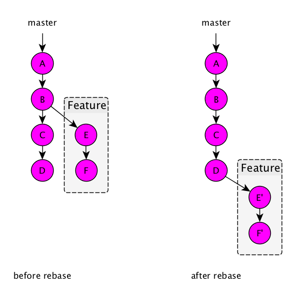


### Pull = Fetch + Merge

`git pull` is a shortcut for `git fetch` + `git merge`.

`git fetch` retrieves the commits from a remote repository, but do not apply
them on your working directory. `git merge` applies them.

You can use `--rebase` to rebase a branch on pull:

``` bash
$ git pull --rebase origin master
```


<!-- .slide: class="hands-on" -->
## 🚀 Hands-on

1. Modify the `README.md` file **on GitLab**
2. Modify the `README.md` file **locally**
3. Push your change without synchronizing your local repository and see what
   happens
4. Rebase your local branch and push it

Congratulations, you have resolved your first conflict 🎉


<!-- .slide: class="hands-on" -->
## 🚀 Hands-on

1. Give access to your GitLab project to a teammate
2. Tell her to propose a change to the `README.md` file
3. Review her code, you can add comments
4. Once everything looks good, accept the merge request

Invert the roles and do these steps again.


<!-- .slide: class="hands-on" -->
## 🚀 Hands-on

1. Each team creates a simple issue, for instance to add a few [lorem
   ipsum](http://lipsum.com/) paragraphs to the `README.md` file
2. Each team forks a project from another team and proposes a fix for the issue
   of that project
3. You can edit your own `README.md` file in the meantime
4. Review the merge request, comment it if needed
5. Accept the merge request when it looks good
