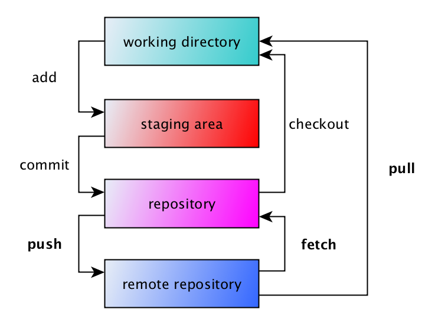

# Collaborating with Git

📌 Learning objectives:

- Learn to collaborate with Git
- Discover GitHub/GitLab
- Start working in team


## Git alone


## The missing piece




## Git remotes


### Managing remotes

Remote repositories are versions of your project that are hosted on the Internet
or network somewhere.

<br>

``` bash
$ git remote -v
origin   git@github.com:TailorDev/slides-git-at-michelin.git (fetch)
origin   git@github.com:TailorDev/slides-git-at-michelin.git (push)
```

``` bash
$ git remote add <name> <repo>
```

``` bash
$ git remote rm <name>
```

``` bash
$ git remote set-url <name> <new repo>
```


## Git clone

`git clone <repo>` downloads a full copy of a repository into a new directory.
Different protocols are supported: file, HTTPS, SSH, etc.

It automatically setups a default `origin` remote for `repo` that you can use
for `push` and `pull`.


## Git pull

`git pull <remote> <branch>` copies changes from a remote repository to a local
repository.


### Pull = Fetch + Merge

`git pull` is a shortcut for `git fetch` + `git merge`.

`git fetch` retrieves the commits from a remote repository, but do not apply
them on your working directory. `git merge` applies them.


## Git push

`git push <remote> <branch>` copies changes from a local repository to a remote
repository.


## Introducing GitLab

GitLab is an Open Source (MIT licensed) web-based Git repository manager with
wiki and issue tracking features.


<!-- .slide: class="hands-on" -->
## 🚀 Hands-on

TODO


## Branching

Branches are what naturally happens when you want to work on multiple features
at the same time.

You wouldn't want to end up with a `master` branch which has Feature A half done
and Feature B half done.


### Creating a branch

`git branch` lists the local branches of your project:

``` bash
$ git branch
* master
```

`git checkout feature` switches to the branch named `feature` if it
exists. To create a branch and switch to it, you can also use:

``` bash
$ git checkout -b feature
Switched to a new branch 'feature'
```


<!-- .slide: class="hands-on" -->
## 🚀 Hands-on

1. Create a branch named `feature`
2. Switch to it (if not done in a single command)
3. Create and commit the following files: `pluton.txt`, `jupyter.txt` and
   `earth.txt`
4. Switch to the `master` branch and see what happens


### Merging a branch

Merging is Git's way of putting a forked history back together again. The `git
merge` command lets you take the independent lines of development created by
`git branch` and integrate them into a single branch.

``` bash
$ git merge feature
```

Always generate a merge commit:

``` bash
$ git merge --no-ff feature
```


### Deleting a branch

``` bash
$ git branch -d feature
```

Force delete a branch with `-D`:

``` bash
$ git branch -D branch-not-merged
```


<!-- .slide: class="hands-on" -->
## 🚀 Hands-on

1. Switch to `master` and merge `feature` into it
2. View the log with the `--graph` option
3. Create a branch named `feature-no-ff`
4. Add a new file `mercury.txt` and commit it
5. Switch to `master` and merge this branch with the `--no-ff` option
6. View the log with the `--graph` option
